# Conservation Biology Toolkit - AWS Architecture

## System Architecture Diagram

```mermaid
graph TB
    %% Users and External Access
    User[👤 Users Worldwide]
    DNS[🌐 Route 53<br/>DNS Management<br/>$0.50/month]
    
    %% Frontend Infrastructure
    CF[☁️ CloudFront CDN<br/>Global Edge Locations<br/>$1-2/month]
    S3[📦 S3 Bucket<br/>Static Website Hosting<br/>React Build Files<br/>$0.50/month]
    
    %% Backend Infrastructure
    LH[🖥️ AWS Lightsail<br/>Ubuntu 22.04<br/>1GB RAM, 1 vCPU<br/>$5/month]
    
    %% Load Balancer
    NGINX[🔄 Nginx Reverse Proxy<br/>SSL Termination<br/>API Routing<br/>CORS Headers]
    
    %% Microservices
    subgraph "Docker Services on Lightsail"
        PA[🧬 Population Analysis<br/>FastAPI :8002]
        SS[📋 Sampling Survey<br/>FastAPI :8003]
        GD[🔬 Genetic Diversity<br/>FastAPI :8004]
        SA[📊 Species Assessment<br/>FastAPI :8005]
        HL[🌍 Habitat Landscape<br/>FastAPI :8006]
        CI[🌡️ Climate Impact<br/>FastAPI :8007]
        CP[🎯 Conservation Planning<br/>FastAPI :8008]
    end
    
    %% SSL Certificate
    SSL[🔒 Let's Encrypt SSL<br/>Free HTTPS Certificates]
    
    %% Connections
    User --> DNS
    DNS --> CF
    CF --> S3
    CF -.->|API Calls| LH
    User -.->|Direct API Access| LH
    
    LH --> NGINX
    NGINX --> PA
    NGINX --> SS
    NGINX --> GD
    NGINX --> SA
    NGINX --> HL
    NGINX --> CI
    NGINX --> CP
    
    SSL --> NGINX
    SSL --> CF
    
    %% Styling
    classDef frontend fill:#e1f5fe,stroke:#01579b,stroke-width:2px
    classDef backend fill:#f3e5f5,stroke:#4a148c,stroke-width:2px
    classDef service fill:#e8f5e8,stroke:#1b5e20,stroke-width:2px
    classDef infrastructure fill:#fff3e0,stroke:#e65100,stroke-width:2px
    
    class CF,S3,DNS frontend
    class LH,NGINX,SSL backend
    class PA,SS,GD,SA,HL,CI,CP service
    class User infrastructure
```

## Request Flow Diagram

## Cost Breakdown

## Scaling Architecture

## Network Architecture

```mermaid
graph TB
    subgraph "Global CDN Layer"
        Edge1[🌍 US East Edge]
        Edge2[🌍 EU West Edge]
        Edge3[🌍 Asia Pacific Edge]
    end
    
    subgraph "AWS Region (us-east-1)"
        subgraph "Frontend"
            S3Bucket[S3 Static Website]
        end
        
        subgraph "Backend (Lightsail)"
            LightsailVPC[Lightsail VPC<br/>10.0.0.0/16]
            Instance[Ubuntu Instance<br/>10.0.0.100]
        end
    end
    
    Internet[🌐 Internet] --> Edge1
    Internet --> Edge2
    Internet --> Edge3
    
    Edge1 --> S3Bucket
    Edge2 --> S3Bucket
    Edge3 --> S3Bucket
    
    Edge1 -.->|API Calls| Instance
    Edge2 -.->|API Calls| Instance
    Edge3 -.->|API Calls| Instance
    
    Internet -.->|Direct API| Instance
```

## Security Architecture

```mermaid
graph TB
    subgraph "Security Layers"
        subgraph "Frontend Security"
            HTTPS1[🔒 HTTPS Only]
            CSP[🛡️ Content Security Policy]
            CORS1[🔄 CORS Headers]
        end
        
        subgraph "Backend Security"
            HTTPS2[🔒 SSL/TLS Encryption]
            FW[🔥 Lightsail Firewall]
            CORS2[🔄 CORS Configuration]
        end
        
        subgraph "Network Security"
            WAF[🛡️ CloudFront Security Headers]
            DDoS[🛡️ DDoS Protection]
            GEO[🌍 Geographic Restrictions]
        end
    end
    
    User[👤 User] --> HTTPS1
    HTTPS1 --> CSP
    CSP --> CORS1
    
    User -.-> HTTPS2
    HTTPS2 --> FW
    FW --> CORS2
    
    WAF --> DDoS
    DDoS --> GEO
```

## Deployment Pipeline

```mermaid
graph LR
    subgraph "Development"
        DEV[👨‍💻 Developer]
        GIT[📁 Git Repository]
    end
    
    subgraph "CI/CD Pipeline"
        BUILD[🔨 Build React App]
        TEST[🧪 Run Tests]
        DEPLOY[🚀 Deploy Script]
    end
    
    subgraph "AWS Infrastructure"
        S3Deploy[📦 S3 Sync]
        CFInvalidate[☁️ CloudFront Invalidation]
        LHDeploy[🖥️ Lightsail Docker Deploy]
    end
    
    DEV --> GIT
    GIT --> BUILD
    BUILD --> TEST
    TEST --> DEPLOY
    
    DEPLOY --> S3Deploy
    DEPLOY --> CFInvalidate
    DEPLOY --> LHDeploy
```

